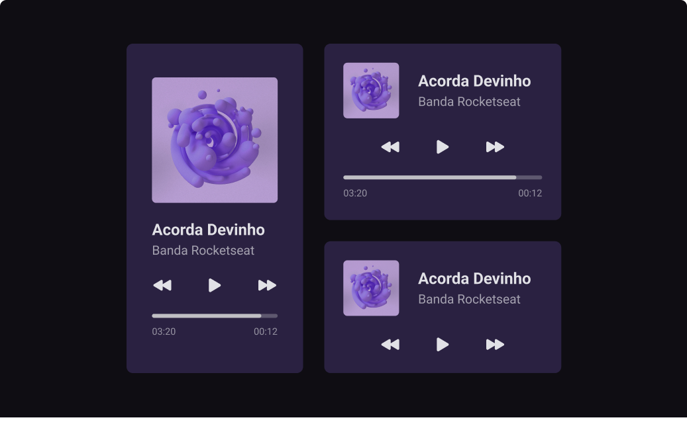

<h1 align="center" id="top">Player de Música</h1>

Primeiro desafio do evento #boraCodar da [Rocketseat](https://www.rocketseat.com.br/).

O desafio é codar um player de música baseado no [layout](https://www.figma.com/file/XnielIsj9qrix1qxAQLT9X/23boraCodar-Desafio-1/duplicate) !!!

  <a href="#-tecnologias">Tecnologias</a>&nbsp;&nbsp;&nbsp;|&nbsp;&nbsp;&nbsp;
  <a href="#-projeto">Projeto</a>&nbsp;&nbsp;&nbsp;|&nbsp;&nbsp;&nbsp;
  <a href="#-layout">Layout</a>&nbsp;&nbsp;&nbsp;|&nbsp;&nbsp;&nbsp;
  <a href="#memo-licença">Licença</a>

  

 

  

 

## 🚀 Tecnologias

Esse projeto foi desenvolvido com as seguintes tecnologias:

- HTML e CSS
- Git e Github
- Figma

## 💻 Projeto

Primeiro desafio do evento #boraCodar - Player de música!!!

- [Visite o projeto online](https://barbaraishioka.github.io/boraCodar/desafio01)

## 🔖 Layout

Você pode visualizar o layout do projeto através [desse link](https://www.figma.com/file/XnielIsj9qrix1qxAQLT9X/23boraCodar-Desafio-1/duplicate). É necessário ter conta no [Figma](https://figma.com) para acessá-lo.

## :memo: Licença

Esse projeto está sob a licença MIT.

#

Feito com ♥ by [Bárbara Ishioka](https://www.linkedin.com/in/barbaraishioka/).

<a href="#top">⬆️ Voltar ao topo</a>

